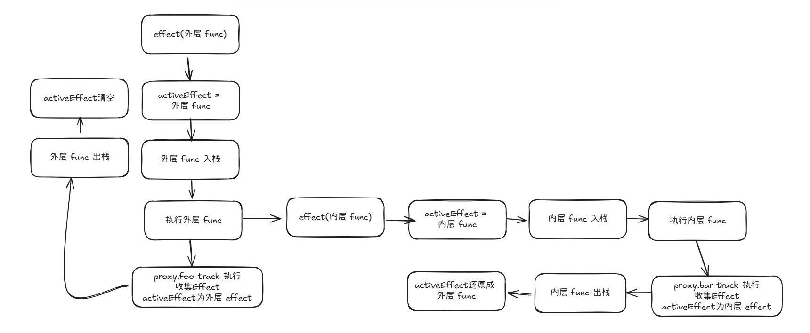

副作用函数中可能会出现嵌套的情况，我们将 effect 修改成

```js
let temp1, temp2;
effect(() => {
  console.log("外层");
  effect(() => {
    console.log("内层");
    temp2 = proxy.bar;
  });
  temp1 = proxy.foo;
});

setTimeout(() => {
  proxy.foo = false;
}, 1000);
```

`proxy.foo = false`时我们期望的是执行外层 effect，但是我们现在的代码，执行后 log 如下：

```js
外层; // 初始化执行effect时log
内层; // 初始化执行内层effect时log
内层; // proxy.foo = false 时trigger log
```

这是由于，我们的 activeEffect 只能存储一个副作用函数，我们 effect 中的代码顺序是先执行内层的 effect，将 activeEffect 修改成了内层 effect
<br />
后执行的 proxy.foo 的读取，这样 obj-foo 依赖收集到的就是内层 effect。

# 解决方案

我们创建一个副作用函数栈，用来存放同一批次的 effect 函数
如上示例，我们期望的处理顺序是这样的



- effect(外层 func)
- activeEffect = 外层 func
- 外层 func 入栈
- 执行外层 func
  - effect(内层 func)
  - activeEffect = 内层 func
  - 内层 func 入栈
  - 执行内层 func
  - proxy.bar track 执行，依赖收集内层 effect
  - 内层 func 弹出栈
  - activeEffect = 外层 func
- proxy.foo track 执行，依赖收集外层 effect
- 外层 func 弹出栈
- activeEffect 清空

# 修改代码

我们只需要修改 effect 方法就行

```js
let activeEffect;
const effectStack = [];
const effect = (fn) => {
  const effectFn = () => {
    cleanup(effectFn);
    activeEffect = effectFn;
    // 把当前effect压入栈中
    effectStack.push(effectFn);
    // 执行effect
    fn();
    // 执行完effect之后，把当前effect从栈中弹出
    effectStack.pop();
    activeEffect = effectStack[effectStack.length - 1];
  };
  effectFn.deps = [];
  effectFn();
};
```
